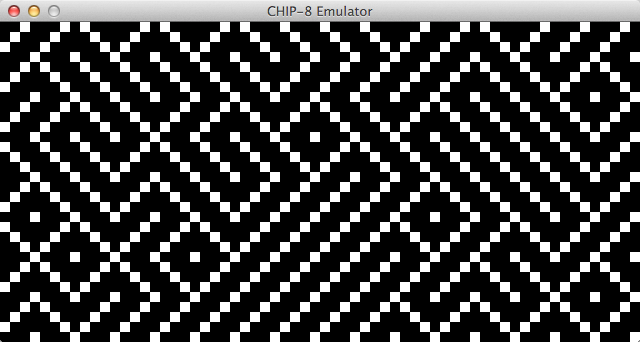
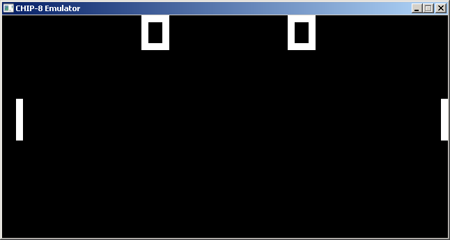

[](https://travis-ci.org/danirod/chip8)
[](https://github.com/danirod/chip8/releases/latest)
[](http://www.gnu.org/licenses/gpl-3.0.html)

# CHIP-8

This is my own implementation of a CHIP-8 emulator made using C and the SDL2
multimedia library. At the moment it is able to emulate a standard CHIP-8
machine implementing all the opcodes provided by the specification.

## Usage

To emulate a binary ROM just provide the file as an argument:

```sh
$ chip8 ~/roms/TETRIS.bin
```

To emulate an hexadecimal ROM you can use the `--hex` flag. Hexadecimal ROMs
are files that only contains ASCII characters representing hexadecimal code.
The ROM is compiled to binary during start up and executed as usual.

Keyboard controls are designed to emulate the classic CHIP-8 controller. This
is the mapping. On the left, the actual CHIP-8 keypad. On the right, the
keys in emulator. It will be possible in future releases to change the keys.
At the moment the only way for doing this is by manually patching the source
code.

```
 Keypad:      Emulation:
 1 2 3 C      1 2 3 4
 4 5 6 D      Q W E R
 7 8 9 E      A S D F
 A 0 B F      Z X C V
```
## Screenshots

GNU/Linux:


MacOS X:




Windows:



## Files

In the subdirectory 'examples' you may find a few public domain ROMs that
can be emulated using this emulator as well as any other emulator you can
find on the Internet.

* See 'COPYING' for copying conditions.
* See 'INSTALL' for compilation and installation instructions.
* See 'NEWS' for a list of changes in latest releases.
* See 'ChangeLog' for a list of technical changes in the source code.
* See 'BUGS' for information on how to report bugs you may find.
* See 'AUTHORS' for the names of the maintainers of the source code.
* See 'THANKS' for a list of contributors and other helpful people.

## Dependencies

In order to compile this project you will need to have SDL 2.0 headers and
libraries in your machine. Head to www.libsdl.org to get those in case
you still haven't got them or get them using your package manager if your
operating system has any.

## License

This project is available under a GNU General Public License v3 license. See COPYING for copying conditions.
